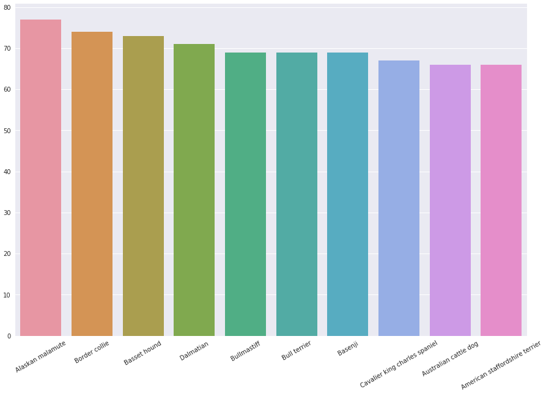

# Dog Breed Identifier

A dog identifier webapp which asks the user for an image and tries to identify the breed od the dog present in the image. If the image contains a human, it will try to detect the breed which resembles the human.

It is a great way to quickly find out a dog's breed by simply inputting images of the dog.

## Overview
We have to design a Convolutional Neural Network (CNN) to identify the breed of the dog present in the input image. This neural network can be built from scratch and trained or we can transfer the learning from one of the pre trained CNN models e.g. VGG-16, Resnet-50 etc and leverage that learning to ease our training process.

## Problem Statement
This project involves creating a CNN from scratch to identify dog breeds, then use transfer learning to add our identification model to the end of the VGG-16 bottleneck. 

Finally to create a algorithm that will take an input image and identify the breed of the dog in the imaage. If a human is found in the image, the model should try to detect the resembling dog breed to the human.

## Metrics
We use `Categorical Crossentropy` as the error / loss function since we are doing a multi class identification, where in the input can be one of many possible outputs. We use `accuracy` to evaluate the fit / test results.

Example 1

Example 2

## Analysis
We go through the data and check which dog breeds are most represented in the training, validation and test data. A high corelation between the three sets would be expected. 

Training Set Top 10 breed names

Validation Set Top 10 breed names

Testing Set Top 10 breed names

Since the images are resized to 224 x 224 which is a square image, it would be advisable for the input images to as close to these dimensions as possible since it would result minimum data loss when resizing the image. We plot the width v/s height of the images in all three sets. The ones close to the diagonal `x=y` have an aspect ratio close to 1.

Training Image sizes

Validation Image sizes

Testing Image sizes

## App Flow

The app looks for a human in the image, if a human is detected, the app looks for the resembling dog breed. If a dog is detected then the app looks for the dog breed.

The app uses openCV's human detection workflow to detect the presence of humans in the provided image. 
The app uses a custom CNN with learning transferred from the Resnet 50 model to identify the dog breed. The last two layers of the Resnet50 model are dropped off and a custom model is added to identify the breeds.

## Commands

Run the following from the project folder

`python ./app/run.py`

## Reflection
We looked briefly at how opencv detects human faces. We looked at using Resnet50 pre-trained model to detect the presence of dogs. We created/trained/testing a CNN from scratch to detect the dog breeds. 

Then we used transfer learning with VGG-16 pre-trained model and added our required layers after the bottleneck. This model was very fast to train even on the CPU, which was a revelation, and gave us a higher accuracy over our model. 

Next we created a webapp which took an input image and identified the breed of the dog or if a human was present tried to identify the resembling dog breed. This app used the model that we trained.

## Improvements
- Have more layers with dropouts after the bottleneck, to prevent overfitting.
- Data augmentation can be used to further prevent overfitting.
- MaxPooling2D could be used with more convolution layers instead of GlobalAverage2D to highlight the minute differences between very similar looking breeds.

